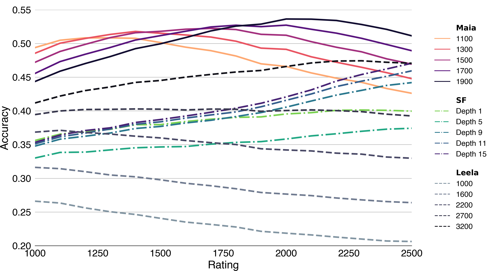

# Aligning Superhuman AI with Human Behavior: Chess as a Model System

## [paper](https://arxiv.org/abs/2006.01855)/[code](https://github.com/CSSLab/maia-chess)/[lichess](https://lichess.org/team/maia-bots)

A collection of chess engines that play like humans, from ELO 1100 to 1900.



In this repo is our 9 final maia models saved as Leela Chess neural networks, and the code to create more and reproduce our results.

You can also play against three of of our models on Lichess:

+ [`maia1`](https://lichess.org/@/maia1) is targeting ELO 1100
+ [`maia5`](https://lichess.org/@/maia5) is targeting ELO 1500
+ [`maia9`](https://lichess.org/@/maia9) is targeting ELO 1900

We also have a Lichess team, [_maia-bots_](https://lichess.org/team/maia-bots), that we will more bots to.

## Chess Engine

The models (`.pb.gz` files) work like any other Leela weights file. So to use them download or compile [`lc0`](http://lczero.org). If the version of `lc0` does not support the weights we have the exact version [here](https://github.com/CSSLab/lc0_23) to compile.

When using the model in `UCI` mode add `nodes 1` when querying as that disables the search.

## Datasets

As part of our analysis all the game on Lichess with stockfish analysis were processed into csv files. These can be found [here](http://csslab.cs.toronto.edu/datasets/chess/kdd2020/)

## Code

### Move Prediction

To create your own maia from a set of chess games in the PGN format:

1. Setup your environment
   1. (optional) Install the `conda` environment, [`maia_env.yml`](maia_env.yml)
   2. Make sure all the required packages are installed from `requirements.txt`
2. Convert the PGN into the training format
   1. Add the [`pgn-extract`](https://www.cs.kent.ac.uk/people/staff/djb/pgn-extract/) tool to your path
   2. Add the [`trainingdata-tool`](https://github.com/DanielUranga/trainingdata-tool) to your path
   3. Run `move_prediction/pgn_to_trainingdata.sh PGN_FILE_PATH OUTPUT_PATH`
   4. Wait a bit as the processing is both IO and CPU intense
   5. The script will create a training and validation set, if you wish to train on the whole set copy the files from `OUTPUT_PATH/validation` to `OUTPUT_PATH/training`
3. Edit `move_prediction/maia_config.yml`
   1. Add  `OUTPUT_PATH/training/*/*` to `input_train`
   2. Add  `OUTPUT_PATH/validation/*/*` to `input_test`
   3. (optional) If you have multiple GPUS change the `gpu` filed to the one you are using
   4. (optional) You can also change all the other training parameters here, like the number of layers
4. Run the training script `move_prediction/train_maia.py PATH_TO_CONFIG`
5. (optional) You can use tensorboard to watch the training progress, the logs are in `runs/CONFIG_BASENAME/`
6. Once complete the final model will be in `models/CONFIG_BASENAME/` directory. It will be the one with the largest number

### Replication

To train the models we present in the paper you need to download the raw files from Lichess then cut them into the training sets and process them into the training data format. This is a similar format to the general training instructions just with our specified data, so you will need to have ``trainingdata-tool` and `pgn-extract` on your PATH.

Also note that running the scripts manually line by line might be necessary as they do not have any flow control logic. And that `move_prediction/replication-move_training_set.py` is where the main shuffling and games selection logic is.

1. Download the games from [Lichess](https://database.lichess.org/) between January 2017 and November 2019 to `data/lichess_raw`
2. Run `move_prediction/replication-generate_pgns.sh`
3. Run `move_prediction/replication-make_leela_files.sh`
4. Edit `move_prediction/maia_config.yml` and add the elo you want to train:
   1. input_test : ../data/elo_ranges/${elo}/test
   2. outputtrain : ../data/elo_ranges/${elo}/train
5. Run the training script `move_prediction/train_maia.py PATH_TO_CONFIG`

We also include some other (but not all) config files that we tested. Although, we still recommend using the final config `move_prediction/maia_config.yml`.

If you wish to generate the testing set we used you can download the December 2019 data and run `move_prediction/replication-make_testing_pgns.sh`. The data is also avaible for download as a CSV [here](http://csslab.cs.toronto.edu/datasets/chess/kdd2020/10000_full_2019-12.csv.bz2)

### Blunder Prediction

>>> IN PROGRESS

## Citation

```
@inproceedings{mcilroyyoung2020maia,
  title={Aligning Superhuman AI with Human Behavior: Chess as a Model System},
  author={McIlroy-Young, Reid and  Sen, Siddhartha and Kleinberg, Jon and Anderson, Ashton},
  year={2020},
  booktitle={Proceedings of the 25th ACM SIGKDD international conference on Knowledge discovery and data mining}
}
```

## License

The software is available under the GPL License.

## Contact

Please [open an issue](https://github.com/CSSLab/maia-chess/issues/new) or email [Reid McIlroy-Young](https://reidmcy.com/) to get in touch
